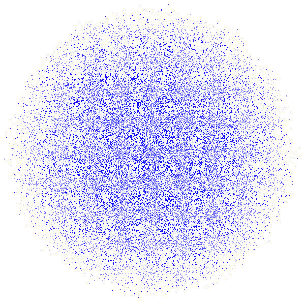

# High-Dimensional Asynchronous Hard-Sphere Generator (C# .NET 8)

This repository implements a high-performance, hardware-aware asynchronous event-driven initialization [engine for hard-sphere packaging](https://github.com/VasOleMil/Compressor) and thermalization tasks in multi-dimensional spaces ($3D$ to $12D$). With virtual particle speed interchange linear complexity is reduced to fixed, further simplification - lowering beyond unit ratio of direction/speed interchange events shows non random behaviour.

## Implementation Peculiarities:

* **Precision-Oriented (Mantissa Bit Restoration):** The solver utilizes a full time-predictor equation form combined with a cubic Halley step to restore lost bits of the double-precision (`double`) mantissa after square root operations. This rigorous approach completely eliminates out-of-range position generation and prevents idle time-stepping drift when subtracting the time-span $dT$ near bounding walls. The additional computational load of the high-precision predictor is compensated by the simplicity of linear approximations when calculating time-spans in the immediate vicinity of the boundary.

* **Dimension-Independent Mass Distribution (Center Reachable):** By scaling the element radius difference inversely to the space dimension ($dR = d/R_n$), the stepping function is regularized against the "curse of dimensionality." This constraints the mass ratio between the heaviest and lightest hard spheres to a strict upper bound: $M_{max}/{M_{min} \to \exp(d)} \approx 1.105,\quad d=0.1$. This prevents the system from generating massive directional mass imbalances, ensuring a stable, contrast-invariant mass distribution that does not polarize or distort as dimensions scale upward.

* **Hyperspace Regularization & Mass-Center Alignment (Center Positioned):** To achieve seamless initial mass-center normalization in high dimensions ($6D+$), the generator initializes coordinates in an expanded hyperspace ($r_n = R_n + 4$). Due to the concentration of measure phenomenon, projecting this higher-dimensional distribution back into the working $R_n$ space naturally shifts the initial mass density away from the bounding wall toward the geometric center. This provides the iterative `NormMassCenter` solver with the necessary spatial clearance (free path buffer `VV`) to align the center of mass into an machine zero ($10^{-16}$ for IEEE 754).

_In contrast, relying purely on a uniform distribution constrained tightly by equal-interaction probability boundary conditions (Pbound) leaves virtually zero spatial clearance in dimensions above 5D. Forcing a linear shift on such boundary-locked configurations nullifies the free path, trapping the normalizer in an infinite loop. By avoiding this and using higher-dimensional regularized seeding instead, the system suppresses artificial initial expansion shockwaves, eliminating long-time memory tails and stable periodic non-ergodic beats during the subsequent 400K+ asynchronous thermalization phase._

## Acknowledgements:
Special thanks to the Gemini LLM group (Google) for analytical collaboration, verification of mathematical boundaries, and assistance in debugging the thermodynamic phase-space constraints during the development of this C# implementation.
